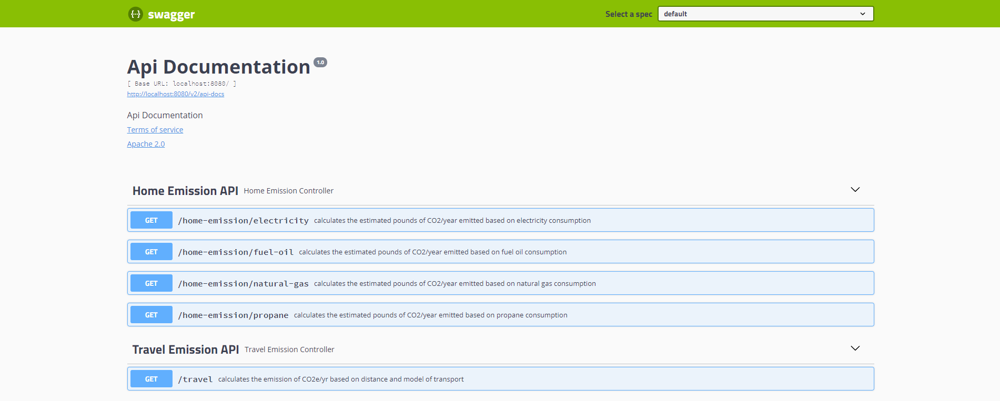

# carbon-footprint-calculator


Backend made in [Spring Boot](http://projects.spring.io/spring-boot/) for SINAI Coding Exercise.

The equations were made based on [GHGCalculator](https://www.epa.gov/sites/default/files/2020-04/documents/ghg-emission-factors-hub.pdf)

## Requirements

For building and running the application you need:

- [JDK 11](https://jdk.java.net/java-se-ri/11)
- [Maven 3](https://maven.apache.org)

## Running the application locally

There are several ways to run a Spring Boot application on your local machine. One way is to execute the `main` method in the `carbon.footprint.calculator.CfcApplication` class from your IDE.

Alternatively you can use the [Spring Boot Maven plugin](https://docs.spring.io/spring-boot/docs/current/reference/html/build-tool-plugins-maven-plugin.html) like so:

```shell
mvn spring-boot:run
```

You can also run tests from command line:

```shell
mvn test 
```

## API Documentation

After running the application, you can visit ``http://localhost:8080/swagger-ui.html`` to see the Api Documentation

